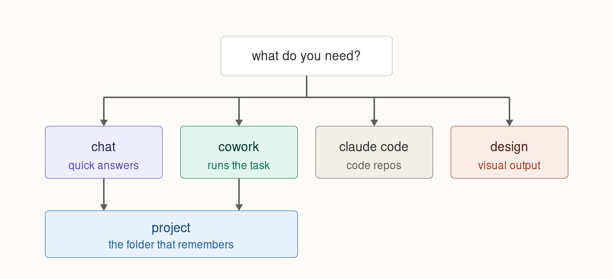

>  **License:** CC BY 4.0
>  **Reuse Policy:** You're free to share, adapt, and build upon this guide for any purpose, even commercially. Just provide proper attribution and indicate if changes were made. The skills and prompt templates in this series are yours to copy and modify without asking.

---

# Start Here: Claude From Scratch

*A fifteen minute orientation for anyone who has only ever typed into a chat box.*

---

# Who This Is For

You have used AI before. Probably ChatGPT. Maybe Perplexity or Gemini. You open a box, you type a question, you get an answer, you close the tab. It works well enough that you have never had a reason to look further.

This guide is for the moment you start suspecting there is more, and you cannot tell from the interface what any of it is for.

I wrote it because a friend asked me a simple question, "what am I actually supposed to do with Claude," and I realised the honest answer took forty minutes and a whiteboard. So here is the whiteboard.

No jargon that I do not explain. No setup instructions you can find in the official documentation. Just the mental model, which is the part nobody gives you.

---

# The One Thing That Makes Claude Different

Chat tools answer questions. Claude can also do work.

That sounds like marketing, so let me be concrete about the difference.

**Answering a question** looks like: you paste a report, you ask what the three main risks are, you get three paragraphs back. The work happened in the conversation. When you close the tab, the conversation is all there is.

**Doing work** looks like: you point Claude at a folder of twelve reports, you say "read all of these, pull out every risk mentioned, group them by theme, and give me a spreadsheet ranked by how often each one comes up." Then you go make coffee. When you come back there is an actual spreadsheet file sitting in that folder, with working formulas in it, that you can open in Excel and send to someone.

The second one is not a better answer. It is a different category of thing. It produced an artifact that exists outside the conversation.

Almost everything else in this guide follows from that distinction.

---

# The Four Rooms

Claude is not one product. It is four places you can work, and most people only ever find the first one.

## Chat

The box you already know. You ask, it answers.

Chat is genuinely good, and I want to be clear that "basic" does not mean "bad." For a one-off question, a quick draft, a translation, a "what does this clause mean," or "summarise this attachment," chat is the right tool and anything else is overkill. It is also the cheapest thing you can do in terms of your usage allowance.

The limit is not intelligence. The limit is that chat produces text in a window. It does not touch your files.

**Use it when:** the task starts and ends in one exchange, and the output is something you will read rather than something you will keep.

## Cowork

Cowork is the room most people have not walked into.

You describe an outcome rather than asking a question, and Claude works on it across many steps: reading files, writing files, running calculations, checking its own output, and fixing what it got wrong. It can keep going after you close your laptop, because the work runs on Anthropic's servers rather than your machine.

It reads and writes real folders on your computer, but only the folders you explicitly connect, and it asks permission before deleting anything.

**Use it when:** the task has multiple steps, touches real files, and ends with something you can open, send, or file.

## Claude Code

The version built for software. It reads an entire codebase, edits files across a repository, runs commands, and works with version control.

I am not going to teach it here, and if you are not a developer you can skip it entirely. What you should know is that Cowork can already write code for you: scripts, batch files, spreadsheet formulas, small automations. You do not need to go into Claude Code to get a Python script written. You need Claude Code when the code itself is the project.

## Design

The visual room. Slides, one-page documents, prototypes, page layouts, anything where the look matters as much as the words.

You describe what you want and iterate on a canvas rather than a chat transcript. I have used it for presentation decks and for website layouts that I then handed to a developer to build.

**Use it when:** the output is meant to be looked at rather than read.

---

# Projects: The Folder That Remembers

This is the concept that unlocks the other three, and it is the one people skip because the name sounds boring.

A project is a container. Inside it you put:

- **Reference material.** Documents, data, notes, anything Claude should know before you start talking. Anthropic calls this project knowledge.
- **Instructions.** Standing directions that apply to every conversation in that project. "Always assume I am writing for a non-technical audience." "Never use bullet points." "Ask me clarifying questions before you start."
- **Conversations.** All the individual chats you have about this subject, kept in one place.

Every new conversation you start inside a project already knows the reference material and already follows the instructions. You stop re-explaining yourself every single time.

**Here is the part that surprises everyone**, and it is worth reading twice because most guides get it wrong:

Conversations inside a project do not automatically know about each other.

If you have a brilliant two hour session on Tuesday and start a fresh conversation on Thursday in the same project, Thursday knows the reference material you uploaded. It does not know what you worked out on Tuesday. Anthropic's own documentation states this plainly: context is not shared across chats within a project unless the information is added into the project knowledge base.

That single fact is the reason the main guide in this series exists. Once you understand it, the fix is obvious and takes thirty seconds at the end of a conversation. Until you understand it, you will keep losing good work and not know why.

---

# Your First Hour

Three things, in this order. Each one teaches something the next one builds on.

## 1. Make a project and put something in it

Pick a subject you actually work on. Not a test, a real one. Make a project for it and upload three or four documents you refer to often.

Then write two sentences of project instructions. Something like: "I am a [your role] working on [subject]. Ask me clarifying questions before producing anything long."

Now start a conversation in it and ask something you would normally have to give background for. Notice that you did not have to give the background.

## 2. Run one real task in Cowork

Not a question. A task with an output.

Good first tasks: turn a folder of messy notes into one organised summary document. Take a spreadsheet and produce a cleaned version with the duplicates removed and a chart. Read a long report and produce a two page briefing with the numbers pulled into a table.

Describe the outcome you want, not the steps to get there. Then let it run without interrupting.

The thing to watch for is that a file appears. That is the moment the difference between chat and Cowork becomes real rather than theoretical.

## 3. Close a conversation on purpose

At the end of any conversation worth keeping, type this:

> Summarise what we worked out in this conversation. Cover the decisions made, the reasoning behind them, anything still open, and anything I should not repeat. Write it so a fresh conversation with no memory of this one could pick up where we left off. Then save it to the project so future conversations can use it.

Read what comes back. Then look at your project knowledge and see it sitting there.

That habit is worth more than any prompt template you will ever collect.

---

# Where To Go Next

That is the orientation. Four rooms, one container, and one habit.

The full guide picks up exactly here and goes into the part that actually separates people who get a lot out of Claude from people who get a little: how work moves between conversations without leaking away.

> **[Working With Claude: Closing the Loop](./Working%20With%20Claude%20-%20Closing%20the%20Loop.md)**

If you would rather poke at things first, do that. Come back when you have had the experience of losing a conversation you wanted back. It will make more sense then.

---

*Written August 2026. Claude changes fast, so treat specific feature names as a snapshot rather than a permanent fact. The mental model has held up longer than any of the features have.*
