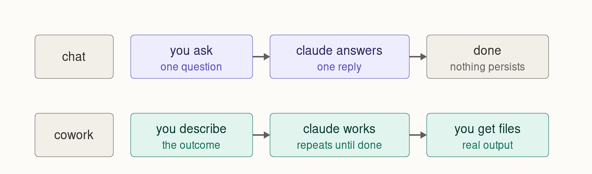
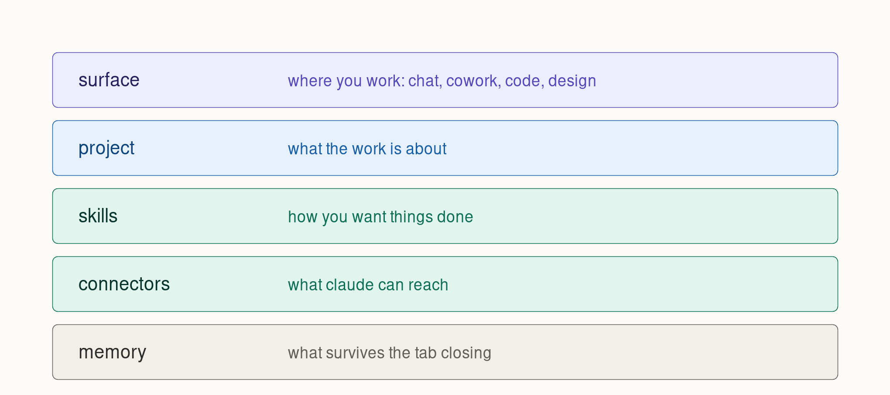
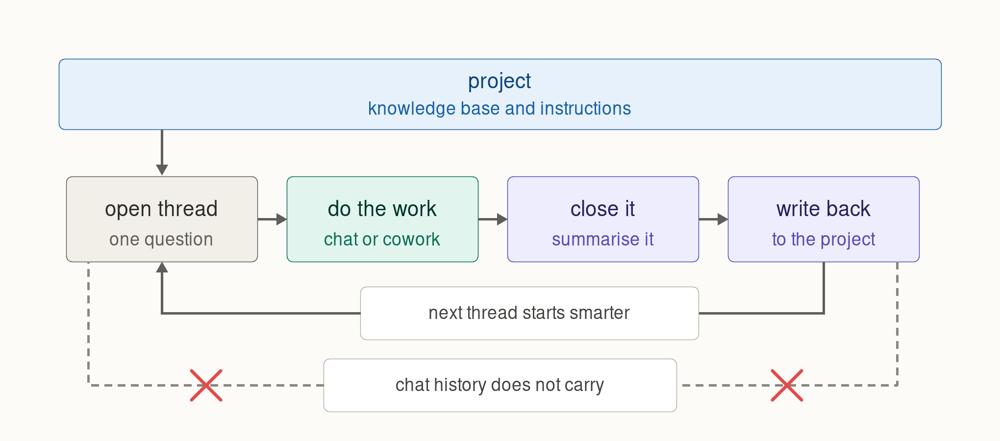
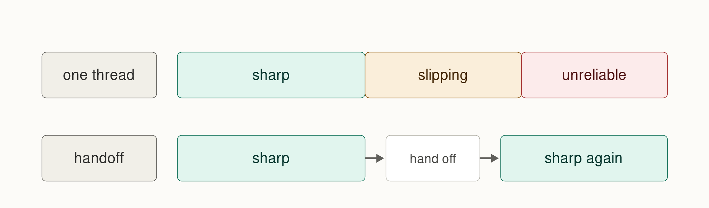

>  **License:** CC BY 4.0
>  **Reuse Policy:** You're free to share, adapt, and build upon this guide for any purpose, even commercially. Just provide proper attribution and indicate if changes were made. The skills and prompt templates in this series are yours to copy and modify without asking.

---

For Table of Contents, click **Outline** button on the right ----------------------------------------------------------------------------------------------^

---

# Working With Claude: Closing the Loop

**New to Claude entirely?** Read [Start Here: Claude From Scratch](./Start%20Here%20-%20Claude%20From%20Scratch.md) first. It is fifteen minutes and it covers the vocabulary this guide assumes.

---

# Why I Built This

A friend asked me how to use Claude. I started answering and realised the useful part of my answer had nothing to do with prompts.

Everyone writes about prompts. There are ten thousand guides telling you to be specific, give examples, assign a role. That advice is fine and it is also the least important thing about working with AI well.

The thing that actually changed my output was smaller and more boring. It is this: I stopped letting conversations end by accident.

Here is the failure it fixes. You have a genuinely good session. Two hours, real thinking, decisions made, dead ends ruled out. You close the tab. Next week you open a new conversation about the same thing and it knows none of it. So you re-explain. Badly, because you have forgotten half of your own reasoning. You end up somewhere slightly worse than where you already were, and the compounding you were promised never happens.

Most people assume this is a memory limitation and that it will get fixed in the next version. It is not. It is a design property, it is documented, and there is a thirty second habit that solves it. Almost nobody does it, because almost nobody knows the property exists.

This guide is about that loop: how work gets into a conversation, and how it gets back out before you lose it.

---

# Why This Works

The habit works because it matches how the tool is actually built rather than how people assume it is built.

People assume Claude accumulates. You talk to it, it learns you, it gets better over time, like a colleague. That intuition is reasonable and it is wrong in a specific way that matters.

What actually accumulates is whatever you deliberately store. A conversation is working memory: enormous, sharp, and gone when it ends. A project is long term storage: durable, but it only holds what you put in it. There is no automatic pipe between the two.

Once you see it that way, the discipline is obvious. You are not managing a relationship with an AI. You are running a workflow with a fast worker who has no long term memory and an excellent filing cabinet. Your job is the ten seconds of filing at the end.

Every other technique in this guide is downstream of that. Instructions, skills, connectors and model choice all make each conversation better. Closing the loop is the only thing that makes the next one better.

---

# The Map, Fast

Claude is four places you can work, plus one container that they sit inside. If you have read the primer, skim this. If not, here is the whole map in six hundred words.


**Chat** is the box you know. One question, one answer. It is the right tool more often than people give it credit for, and it uses the least of your usage allowance. Its ceiling is that it produces text in a window and does not touch your files.

**Cowork** is agentic. You describe an outcome instead of asking a question, and Claude plans, acts, checks its own work, and iterates until it is done. It reads and writes real folders on your machine, but only the ones you connect, and it runs on Anthropic's servers, so it keeps working after you shut your laptop. It produces spreadsheets with working formulas, formatted documents, decks, and organised files.




**Claude Code** is the same agentic engine pointed at a codebase, in a terminal. If you are not a developer you can skip it, and I mean that literally rather than politely. Cowork already writes scripts, formulas and small automations for you. You need Claude Code when the code is the project rather than a byproduct of it.

**Design** is the visual room: decks, one-pagers, prototypes, layouts. You iterate on a canvas instead of a transcript.

> **Deep dive:** [Code and Design in practice](./claude-loop-deepdives/06-code-and-design.md), including what I have actually shipped with each and where the seams are.

**Projects** are the container, and this is where most maps go wrong by listing Projects as a fifth surface. It is not a place you work. It is a folder that holds reference material, standing instructions, and a set of related conversations. Chat and Cowork both run inside projects. Claude Code uses a file called `CLAUDE.md` for the same purpose. Design does not use projects at all.

> **Deep dive:** [Projects and threads](./claude-loop-deepdives/01-projects-and-threads.md), including size limits, when to start a new project versus a new thread, and what project knowledge actually is.

Underneath all of it sit four layers you can adjust. Most people never touch any of them.



---

# How This Compares to What You Already Use

You are probably coming from something else, so here is the honest translation. Names in this space change every few months, so treat this as an August 2026 snapshot.

**If you use ChatGPT:** Projects map directly to ChatGPT Projects. The Cowork equivalent is ChatGPT Work. Artifacts map to Canvas. Skills are called Skills in both, and they use the same open standard and the same `SKILL.md` file format, which means a skill you write for one genuinely runs in the other. Claude Code maps to Codex.

One trap worth flagging: ChatGPT Work behaves differently depending on where you open it. The desktop app can reach local files. The web and mobile versions cannot. If you read about Cowork touching your folders and then try the browser version of Work, you will conclude the feature does not exist.

**If you use Perplexity:** Projects map to Perplexity Projects, which were called Spaces until July 2026. The Cowork equivalent is Perplexity Computer. Perplexity is genuinely ahead in two places I will not pretend otherwise about: its agent edits the same file across sessions rather than regenerating a new one, and a teammate can pick up where your session left off. The multiplayer story is better than Claude's today.

**If you use Gemini:** Projects map to Notebooks, which sync with NotebookLM. The agentic equivalent is Gemini Spark, formerly Gemini Agent, though it leans toward personal admin like inbox and calendar rather than producing work deliverables. Google's advantage is that Spark keeps running with every one of your devices switched off.

**If you use Microsoft Copilot:** Notebooks are the project equivalent and Pages are the artifact equivalent. There is no single Cowork-like workspace. Agent Mode lives inside Word, Excel and PowerPoint individually. Microsoft's real advantage is that it edits the actual Office file in the actual application, which nobody else does properly.

**A note on the landscape.** I use Claude as my daily driver and this guide reflects that. It is not a claim that Claude wins on every axis. It clearly does not. Take the parts that are useful and ignore the parts where your tool already does it better.

---

# The Thing Nobody Tells You

Here is the fact this whole guide rests on.

**Conversations inside a project do not share context with each other.**

Not "they share it imperfectly." They do not share it. Anthropic's own help documentation says so directly:

> Context is not shared across chats within a project unless the information is added into the project knowledge base.

What is shared across every conversation in a project is: the reference material you uploaded, the project instructions you wrote, and the project's own memory space. What is not shared is the conversation itself. The reasoning, the decisions, the things you ruled out, the sharp thing you said at minute ninety. None of it travels.

I want to sit on this for a second because it is genuinely counterintuitive, and because a lot of otherwise decent guides state the opposite. If you have read somewhere that "projects remember across chats," that is wrong in the way that matters. Projects remember what you filed. They do not remember what you said.

There is a related trap. Uploading a file to a conversation is not the same as adding it to project knowledge. A file you drop into a chat is visible in that chat only. And if you edit that file on your computer afterwards, the copy in project knowledge does not update. You have to upload it again.



That crossed line is the whole problem. The solid line through the project is the whole solution.

---

# The Loop

So here is the working discipline. Four moves, and only the last two are unusual.

## 1. Open a thread with one job

A thread is one conversation. Give it one question, one decision, or one deliverable. Not a subject area, a job.

"Understand retrieval augmented generation" is a subject and it will sprawl for six hours. "Work out whether retrieval augmented generation is the right approach for our support documentation, and what it would take" is a job with an end.

The test is whether you can imagine the sentence that means it is finished. If you cannot, split it.

> **How I actually do it**
> I name threads as questions. When I open a project and see fifteen threads all named "chat with Claude," the project is dead to me. When I see "does gateway architecture solve our routing problem," I know in one second whether I want that thread again.

## 2. Do the work in whichever room fits

Chat if the thread is thinking and writing. Cowork if it needs to touch files or run for a while. You can start a Cowork session from inside a project, so this is not a fork in the road, it is just picking a tool mid-conversation.

## 3. Close it deliberately

This is the move almost nobody makes.

Before you close the tab, you ask Claude to summarise what the conversation produced, in a form a stranger could use. Not a transcript. A distillation: what was decided, why, what is still open, what turned out to be a dead end.

The dead ends matter more than people expect. Half the value of a two hour session is the four approaches you ruled out. If you only save the conclusion, the next thread will happily walk back into all four.

## 4. Write it back

Then you put that summary into project knowledge, where the next thread will see it.

That is it. Open, work, close, write back. Thirty seconds at the end of each thread, and the project gets smarter every time instead of staying frozen at whatever you uploaded on day one.

> **How I actually do it**
> I have this as a saved skill so I do not have to remember the wording. I type three words and it runs. The exact skill is in the [skills library](./claude-loop-deepdives/04-skills-library.md) and you are welcome to it.

---

# The Closing Ritual

Here is the actual text. Copy it, paste it at the end of any thread worth keeping.

```
Close this thread out.

Summarise what we worked out, written so a fresh conversation with no
memory of this one could pick up cleanly. Cover:

1. What we decided, and the reasoning behind each decision
2. What we ruled out, and why, so it does not get re-litigated
3. What is still open, and what would settle it
4. Anything I said about how I want this handled that should persist

Keep it tight. This is a working note, not a transcript.

Then save it to the project knowledge so future threads in this project
can use it.
```

Two things about the wording, because they are deliberate.

**"So a fresh conversation with no memory of this one could pick up cleanly"** is doing real work. Without it you get a summary written for you, full of "as we discussed" and pronouns pointing at things that are no longer there. With it you get something self contained.

**"What we ruled out, and why"** is the line most people would cut, and it is the one I would keep if I could only keep one. Negative knowledge is expensive to acquire and free to lose.

> **How I actually do it**
> Not every thread earns this. A quick lookup does not need a closing note and cluttering the project with trivia makes it worse, not better. My rough test is whether I would be annoyed to redo the thinking. If yes, close it properly. If no, just shut the tab.

---

# When to Hand Off Instead

Closing a thread is what you do when the work is finished. A handoff is different. It is what you do when the work is not finished but the thread is.

## What is actually happening

Every conversation has a context window: the amount of material the model can hold in view at once. It is measured in tokens, which are chunks of text roughly three and a half characters long. Anthropic's own rough conversion is that two hundred thousand tokens is about five hundred pages.

Current Claude models hold a million tokens, which sounds like enough that this section should not need to exist. It is not, for a reason that has nothing to do with the number.

## The gradient, not the cliff

As the window fills, accuracy declines. Not suddenly, and not with a warning.

The clearest published finding is positional. A 2023 paper from Stanford, "Lost in the Middle," found a U-shaped curve: material at the very start and very end of a long input is handled well, and material buried in the middle is the most likely to be missed. In their multi-document tests, accuracy at the best position was over twenty points higher than at the worst, and at the worst positions performance dropped below what the same model scored with no documents at all.

More recently, an Anthropic paper from May 2026 measured a monitoring model catching a specific problem in a transcript. Recall fell from 98.6 percent to 88 percent when 800,000 tokens of ordinary content were placed in front of the same problem. Same model, same task, same problem, twice as likely to be missed.

Anthropic's own framing is the one I would keep, because it is careful and it is accurate:

> These factors create a performance gradient rather than a hard cliff: models remain highly capable at longer contexts but may show reduced precision.

That is the practical point. There is no threshold where things break. There is a slow slide where a model that was catching your errors quietly stops catching them, and nothing on screen tells you it happened.



## What a handoff is

Think about a conversation with a person that has gone on for five hours. You are both still talking. Neither of you is thinking well. The right move is not to push through, it is to stop, agree what you have got, and resume tomorrow.

A handoff is that, compressed. You ask the current thread to write everything a successor would need, you open a fresh thread, and you paste it in. The new thread starts with the substance and none of the accumulated sediment.

Ask for a handoff when you notice any of these:

- Claude repeats a point you settled an hour ago
- It contradicts something it said earlier in the same thread
- It starts hedging on things it was previously specific about
- You are about to start a substantial new phase of work
- You simply cannot remember what is in the thread anymore

That last one is a better signal than people give it credit for. If you have lost the plot, so has the model.

> **How I actually do it**
> I ask "do you have enough context to keep going, or should we hand off?" and I ask it before I need to, not after. The tell that you waited too long is that the handoff note itself comes back thin. A degraded thread writes a degraded summary, which is a genuinely annoying way to lose work.

> **Deep dive:** [Context and handoffs](./claude-loop-deepdives/02-context-and-handoffs.md), with the full handoff prompt, what the research actually shows, and the difference between a handoff and a close.

---

# Making It Yours

Three layers, in the order I would add them. You do not need all three, and adding them all at once is how people end up with a setup they do not understand.

## Instructions

The highest return per minute of anything in this guide.

Instructions are standing directions that apply automatically. They live at three levels: your account, an individual project, and, for Team and Enterprise plans, the whole organisation.

The single instruction I would give anyone is some version of this:

```
When I ask you to help with something non-trivial, ask me clarifying
questions before you produce anything. Give me the questions as multiple
choice with a short explanation of the tradeoffs, plus your recommendation
and the reason for it, so I can answer quickly.
```

This changes the shape of every interaction you have. Instead of getting a confident answer to the question you badly phrased, you get asked what you actually meant. The number of wasted drafts drops off a cliff.

> **Related guide:** I wrote about this pattern in detail in [The context prompt that will revolutionize your workflow](https://github.com/VeritasPlaybook/playbook/blob/main/ai-powered-workflows/The%20context%20prompt%20that%20will%20revolutionize%20your%20workflow.md). It works with every model, not just Claude.

> **Deep dive:** [Custom instructions](./claude-loop-deepdives/03-custom-instructions.md), covering all three levels, what happens when they conflict, and the instructions I actually run.

## Skills

A skill is a folder with a file in it that says "when I ask for X, here is how to do it." Claude loads it only when it is relevant, so having twenty skills does not slow anything down.

The thing that took me longest to understand: the description field is not documentation, it is the trigger. Claude reads only the name and description of every skill, all the time, and uses that to decide whether to open the rest. So a description that says what the skill does but not when to use it will simply never fire.

Bad: `Formats meeting notes.`
Good: `Turns raw meeting notes into a structured summary. Use whenever the user pastes meeting notes, transcripts, or call notes and wants them cleaned up, even if they do not say the word "format".`

The practical rule for when something becomes a skill: the third time you type roughly the same instructions, stop and make it a skill.

> **Deep dive:** [The skills library](./claude-loop-deepdives/04-skills-library.md), with three of mine as copy-paste files, the file format, and a prompt that gets Claude to write a skill for you from scratch.

## Connectors

A connector plugs Claude into a system you already use: Google Drive, Gmail, Slack, GitHub, Notion, and a few hundred others. Underneath it is the Model Context Protocol (MCP), an open standard for letting AI models talk to outside tools.

The important safety property: Claude inherits your permissions. It cannot see anything in a connected system that you could not see yourself.

The important performance property: every active connector costs context, all the time. Past about ten of them you should switch tool access from automatic to on demand, or you are paying for reach you are not using.

> **Deep dive:** [Connectors and MCP](./claude-loop-deepdives/05-connectors-and-mcp.md).

## Picking a model

Worth thirty seconds, not worth an afternoon. Short version of what I do: a mid-tier model handles most work, I escalate for genuine judgment calls, and I drop to a cheap fast model for anything that is really just fetching and following instructions. The most useful lever is usually not which model but how much effort you tell it to spend.

> **Deep dive:** [Picking a model](./claude-loop-deepdives/07-picking-a-model.md), current as of August 2026, including what I use as a daily driver and why I almost never reach for the top of the range in knowledge work.

---

# Honest Caveats

**This is a snapshot.** Written August 2026. Claude ships changes weekly. Feature names in this guide will rot before the mental model does. If something here does not match what you see on screen, believe the screen.

**Some of this is in beta.** Cowork on web and mobile, several of the Microsoft Office integrations, and letting Claude drive your computer are all beta or research preview as I write this, with availability that differs by plan and sometimes by region.

**Anthropic's own documentation contradicts itself in at least one place.** One help article says the automatic summarisation that happens in long conversations does not count against your usage limit. Another says longer conversations that trigger it consume more of your limit. I could not resolve which is correct, so I have not asserted either.

**Memory is mid-migration.** Anthropic is moving between two different memory systems and which one you have depends on your plan. Memory also does not currently work in Cowork outside of projects, and memory from chat does not carry into Cowork at all. If you are relying on memory to do the job that this guide says to do manually, check which system you are on first.

**I have not tested everything here at equal depth.** The thread discipline, projects, instructions and skills are things I use daily and would defend. Design and Claude Code I use in bursts. Where I am reporting rather than practising, I have tried to say so.

---

# How This Connects to the Other Guides

This is part of a series. Each one stands alone, and they compound.

- **[Start Here: Claude From Scratch](./Start%20Here%20-%20Claude%20From%20Scratch.md)** - the fifteen minute orientation if this guide assumed too much
- **[The context prompt that will revolutionize your workflow](https://github.com/VeritasPlaybook/playbook/blob/main/ai-powered-workflows/The%20context%20prompt%20that%20will%20revolutionize%20your%20workflow.md)** - getting AI to ask smart questions before it works
- **[Building a Cyberbrain](https://github.com/VeritasPlaybook/playbook/blob/main/ai-powered-workflows/Building%20a%20Cyberbrain.md)** - what this looks like taken all the way, with Obsidian and MCP as the storage layer
- **[AI Workflow for Resumes That Actually Land](https://github.com/VeritasPlaybook/playbook/blob/main/ai-powered-workflows/AI%20Workflow%20for%20Resumes%20That%20Actually%20Land.md)** - the same project-plus-skills pattern applied to one specific job
- **[A Practical RLM-Inspired Workflow for Deep Research with AI](https://github.com/VeritasPlaybook/playbook/blob/main/ai-powered-workflows/A%20Practical%20RLM-Inspired%20Workflow%20for%20Deep%20Research%20with%20AI.md)** - a seven phase research method that leans hard on threads as units of work
- **[The 2026 Frontier Model Guide](https://github.com/VeritasPlaybook/playbook/blob/main/frameworks/The-2026-Frontier-Model-Guide.md)** - choosing between vendors rather than between Claude models

---

# The Deep Dives

| Guide | What it covers |
|---|---|
| [Projects and threads](./claude-loop-deepdives/01-projects-and-threads.md) | What project knowledge actually is, size limits, new project versus new thread |
| [Context and handoffs](./claude-loop-deepdives/02-context-and-handoffs.md) | Tokens in plain language, the research, the full handoff prompt |
| [Custom instructions](./claude-loop-deepdives/03-custom-instructions.md) | Three levels, precedence, and the instructions I run |
| [The skills library](./claude-loop-deepdives/04-skills-library.md) | Three copy-paste skills, the file format, and how to write your own |
| [Connectors and MCP](./claude-loop-deepdives/05-connectors-and-mcp.md) | What MCP is, adding connectors, the context cost |
| [Code and Design in practice](./claude-loop-deepdives/06-code-and-design.md) | What I have shipped with each, and where the seams are |
| [Picking a model](./claude-loop-deepdives/07-picking-a-model.md) | The current lineup, effort levels, and my daily driver |

---

# Questions or Feedback

Found something wrong, or something that changed? Open an issue on this repository or reach me on [LinkedIn](https://www.linkedin.com/in/malocilja/). Corrections are genuinely welcome, particularly on anything I flagged as unverified.

---

*Written August 2026.*
