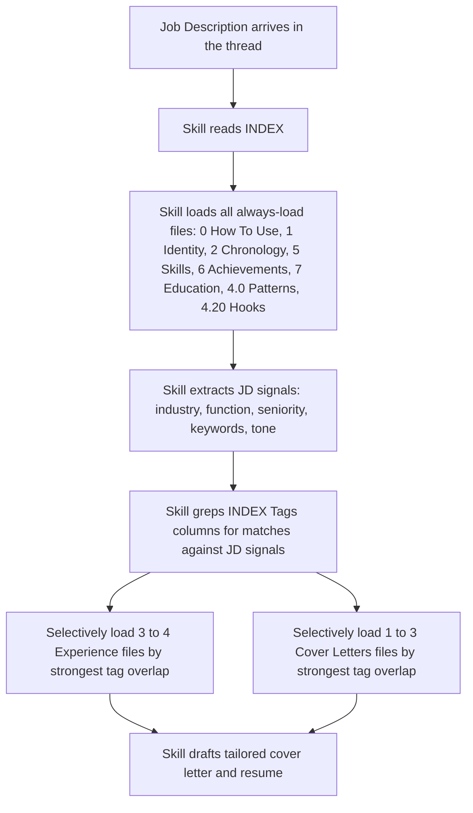

>  **License:** CC BY 4.0
>  **Reuse Policy:** You're free to share, adapt, and build upon this guide for any purpose, even commercially. Just provide proper attribution and indicate if changes were made.

---

# The Career Brain Trust: Structure and Why It Works

This is a deep dive on the source-of-truth folder that everything else in the workflow pulls from. The main guide sketched the structure in [Step 4](https://github.com/VeritasPlaybook/playbook/blob/main/ai-powered-workflows/AI%20Workflow%20for%20Resumes%20That%20Actually%20Land.md#step-4-build-your-career-brain-trust). This is the longer version: why the structure looks the way it does, how each piece pulls its weight, how to grow it without breaking it, and how to actually get yours built.

If you have not read the main guide yet, [start there](https://github.com/VeritasPlaybook/playbook/blob/main/ai-powered-workflows/AI%20Workflow%20for%20Resumes%20That%20Actually%20Land.md). This deep dive assumes you understand the loop and where the Career Brain Trust sits inside it.

---

# The Problem the Structure Solves

The first version of my Career Brain Trust was a single Markdown file. One document, well over 200 pages when printed, with every job, every metric, every cover letter, and every positioning statement I had ever written. The logic was simple: keep everything in one place, search with Ctrl+F, done.

It worked for about three weeks. Then I started hitting the wall.

The first problem was practical. When I asked Claude to tailor a resume, the skill tried to read the whole file. Past roughly 25,000 tokens of output, the tool started truncating. Long files came back partial. The skill would summarize from the first half and miss the second half. Critical details (a metric, a framing, a guard rule) would silently disappear from the draft because the file simply did not finish loading.

The second problem was worse. Even when the file did load fully, the model was now juggling everything at once: my current role, a job I held a decade earlier, a cover letter archetype for banking, a positioning statement aimed at startups. The signal-to-noise ratio collapsed. The first drafts read like the average of everything I had ever written, not the best of what was relevant to this specific Job Description (JD).

The third problem was maintenance. Updating a 200-page file is miserable. You scroll forever to find the right section. You introduce duplicates because you forgot you already wrote that bullet somewhere else. You stop updating because the friction is too high. The system rots from the inside.

The structure exists to fix all three at once. Smaller files mean no truncation. Per-role and per-archetype files mean the skill loads only what is relevant. Modular files mean you can update one piece without touching the others. The folder is doing the same job a database would do if you were writing your own software. You are paying a small upfront tax (the structure) to get a much larger ongoing dividend (clean loads, focused drafts, painless maintenance).

---

# The Folder Structure

Here is the canonical layout, the same one the empty template ships with:

```
Brain Trust/
|
|-- INDEX.md                       # Master file map with tags per child file
|-- 0 How To Use.md                # Tag glossary, acronyms, maintenance habits
|-- 1 Identity.md                  # Headline, summary, positioning statement library
|-- 2 Chronology.md                # Master career timeline
|-- 5 Skills.md                    # Aggregated skill inventory
|-- 6 Achievements.md              # Big numbers organized by employer
|-- 7 Education.md                 # Degrees, certifications, awards, languages
|
|-- _session rules/                # Hard rules the skill must honor every run
|   |-- always use skill creator.md
|   |-- (add your own as patterns emerge)
|
|-- Experience/                    # One child file per role
|   |-- 3.1 Most Recent Role.md
|   |-- 3.2 Second Most Recent Role.md
|   |-- 3.3 Third Most Recent Role.md
|
|-- Cover Letters/                 # One child file per archetype
|   |-- 4.0 Patterns.md            # House-style cover letter skeleton
|   |-- 4.1 Archetype One.md       # e.g., Banking
|   |-- 4.2 Archetype Two.md       # e.g., Startup
|   |-- 4.20 Reusable Hooks.md     # Modular building blocks
```

A few things to notice. The top-level numbered files (0 through 7) are the small, always-load files. They are intentionally short so they can all load on every run without pushing the context window. The two subfolders (Experience and Cover Letters) hold the longer per-role and per-archetype child files. Those load selectively, only when a Job Description matches their tags.

The `_session rules/` folder is where you encode the hard guard rules you discover the hard way (more on this in Deep Dive 2). These are the rules you want the skill to honor on every single run, no matter what the Job Description looks like.

The number gaps in the top-level files (jumping from 2 to 5) are deliberate. Sections 3 and 4 live inside the Experience and Cover Letters subfolders. Skipping 3 and 4 at the top level reminds you the per-role and per-archetype content has its own home.

---

# Why We Split From a Monolithic File

The monolithic version felt simpler. It had two real virtues: a single file you could grep, and no decisions about where new content went. Every new bullet, every new framing, every new metric landed in the same document. Cognitively easy to maintain in the short term.

What killed it was scale. Past about 25,000 tokens of output, Cowork's tool calls started truncating. Different tools have different limits, but you will hit one. The exact number does not matter; the shape of the problem does. A truncated read is worse than no read. The skill thinks it has the full context and silently misses the second half. You discover the gap when a metric is wrong in the draft or a guard rule was ignored.

The modular structure makes that failure mode impossible. The INDEX is small. The top-level files are small. The per-role files load three or four at a time, not ten. The total payload for any given Job Description is well under any reasonable tool limit. Truncation simply does not happen.

There is a second, more subtle benefit. Smaller files force you to write more clearly. When everything lives in one document, you can be sloppy: half-finished thoughts pile up, duplicate bullets accumulate, draft and canonical versions sit next to each other indistinguishably. When the structure forces each role into its own file, you have to decide. Which bullet is canonical? Which variant framings are worth keeping? Which positioning statement belongs in this role versus the Identity file? The structure becomes a forcing function for editorial discipline. The output gets better because the upstream content got cleaner.

A third benefit, which only shows up after about ten applications: the per-file structure lets the system grow without rewrites. New cover-letter archetypes land as new files. New role variants land inside the role's child file. Nothing has to be reorganized to absorb new material. A monolithic file would need a major refactor every few weeks just to stay readable. The structure absorbs growth.

---

# How the 3.X and 4.X Numbering Works

The numbering scheme is more than aesthetic. It encodes recency order and lets the skill reason about your career chronologically without re-reading the dates every time.

For Experience files, `3.1` is your most recent role, `3.2` is the second most recent, `3.3` is the third, and so on. When the skill needs to pull "your three most recent roles," it can just grab `3.1`, `3.2`, `3.3` by filename. No date math required.

If you have off-LinkedIn or advisory roles you want available to the skill but not on the public profile, use `3.A1`, `3.A2`, etc. The "A" prefix signals "advisory" or "alternate" and keeps them out of the default load. The skill will only pull `3.A` files if you explicitly mention an advisory role in the conversation.

For Cover Letters, `4.1`, `4.2`, `4.3`, etc., are your real archetypes (one per company shape you target). The `4.0` slot is reserved for the Patterns file (the house-style skeleton every archetype builds on). The `4.20` slot, intentionally far from the rest, holds the Reusable Hooks file (the modular building blocks you mix and match inside any archetype).

The gap between `4.2` and `4.20` is room to grow. You can add `4.3`, `4.4`, `4.5`, and so on as new archetypes emerge from real applications, without re-numbering anything. The Hooks file sits comfortably after the others thanks to its `4.20` prefix sorting late. This sounds trivial. It is. But trivial things you got right at the start save you from miserable rename operations six months in.

When you re-rank (a new most-recent role bumps the old `3.1` down to `3.2`), you just rename the files and update the INDEX. No content moves. The bullets are stable; only the prefixes shift. The same is true when you retire an archetype: the file stays in the folder as a record, but you drop the row from the INDEX so the skill stops loading it.

---

# How the INDEX Drives Selective Reads

The INDEX is the routing table. It is the only file the skill is guaranteed to read in full on every run. Everything else loads on demand.

Here is the loop the skill walks every time you trigger it on a new Job Description:



The Tags columns in the INDEX are doing the real work here. Every Experience and Cover Letter row has a Tags column with short hash-prefixed labels like `#FinTech`, `#Payments`, `#Distributed`, `#PLG`, and so on, that describe what is in the file. When the skill processes a Job Description, it pulls the natural-language signals out of the JD (industry words, function words, technology names, seniority markers) and matches them against the Tags columns by grep.

The matching does not need to be exact. The model is doing the matching, not strict regular expressions. "Distributed systems" in the Job Description matches `#Distributed` in the Tags. "Product-Led Growth (PLG)" or "PLG" in the JD matches `#PLG` and `#Growth`. "Banking" or "regulated financial services" matches `#Banking`, `#Regulated`, and `#Compliance`. The skill ranks the matches and picks the top three or four roles to load fully.

The result is a load profile that looks something like this for any given application: roughly eight small always-load files, plus three or four longer Experience files, plus one to three Cover Letters files. Total token count well under the truncation limit, every time.

This is the routing pattern that makes the system scale. You can grow your Brain Trust to thirty or forty files without slowing anything down or introducing new failure modes. The INDEX absorbs the complexity. The skill stays fast because it only ever loads what is relevant.

A note on Tags hygiene. Tags should be specific enough to discriminate but stable enough to last. `#FinTech` is good. `#Stripe-style-fintech` is overfitting. `#Backend` is good. `#GoLang-only-backend-services` is overfitting. The point is to have ten to twenty Tags that show up across multiple files, and another ten to twenty that are role-specific. The Tag glossary in `0 How To Use.md` is where you document your active set so you do not invent new spellings of the same idea over time.

---

# How to Update the Brain Trust Over Time

The structure is designed to absorb new content additively, without rewriting the canonical material. There are three update events that come up most often:

**A new framing surfaced in an application.**
You wrote a sharper version of a canonical bullet during the back-and-forth with Claude on a specific Job Description. The new framing belongs in the relevant Experience file under a "Variant Framings" block, with a date tag and a note about which job it came from. The canonical bullet stays canonical. The variant lives alongside it, available for future applications.

**A new metric or big number.**
Append it to `6 Achievements.md` under the matching employer header, with the source (which application surfaced it, what month, what role). The Achievements file is the metrics warehouse. Everything quantitative belongs there. The Experience files reference metrics, but Achievements is the canonical home.

**A new cover letter archetype.**
You wrote a cover letter for a company shape you had not encountered before (your first health-tech application, your first government Request for Proposal, your first Artificial Intelligence research-lab role). The pattern is worth keeping. Create a new `Cover Letters/4.NN [Archetype].md` file, copy the strongest sections in, add a row to the INDEX Cover Letter Library table with tags, and the next application of that shape benefits.

The `update-brain-trust` skill (the subject of Deep Dive 3) automates this. The skill ingests the tailored resume, cover letter, and Job Description from the thread, diffs the new content against your existing canonical and variant material, asks you which additions to keep, and applies the changes additively. The INDEX timestamp refreshes. The application gets logged. The thread closes cleanly.

What you should not do: dump new content straight into the INDEX, rewrite a canonical bullet because the variant felt sharper, or rename files because a role title changed. Variants are variants. Canonical bullets are stable. Title changes belong as a note inside the role's child file, not as a folder rename. The reason is simple: every rename forces you to update every reference to the old name across every file, plus update the INDEX, plus update any scripts that point at canonical paths. Append, do not rewrite.

The Brain Trust is meant to compound. Every application adds material. Nothing gets deleted unless it is wrong. After fifty applications, you have a much richer source of truth than after five, but the structure is identical.

---

# The Three Ways to Build Yours

There are three legitimate paths to a usable Career Brain Trust. Pick the one that fits how you like to work. Most people end up combining two of them.

**Path A: Download [the empty template](https://github.com/VeritasPlaybook/playbook/tree/main/ai-powered-workflows/ai-resume-deepdives/templates/Career%20Brain%20Trust%20Template) and fill it in by hand.**

The template ships with every file scaffolded. The INDEX has placeholder rows. Each child file has section headers ready, with the tag glossary and acronym definitions waiting in `0 How To Use.md`. You open each file, fill in your actual content, and save. Slowest path, but the path that produces the deepest material because you wrote every word.

Best fit if you are the kind of person who wants to feel every part of the system before you trust it. You will learn the structure inside out. The downside is that the first version takes a full afternoon, sometimes two.

**Path B: Run the setup prompt with Claude.**

The template package includes [a setup prompt](https://github.com/VeritasPlaybook/playbook/blob/main/ai-powered-workflows/ai-resume-deepdives/templates/Career%20Brain%20Trust%20Setup%20Prompt.md) you paste into a fresh Claude thread. Claude walks you through an interview: a few dozen short questions about your roles, your standout metrics, your cover letter patterns, the company archetypes you target. Claude builds the folder structure for you, fills in the files as you answer, and shows you the result before saving.

Best fit if you have less than a week of runway to get the system working and you want to start tailoring applications by tomorrow. The interview takes roughly forty-five minutes to an hour. The output is a usable first version, not a polished final version. You will keep refining the files over the next few applications, but you have something working immediately.

**Path C: Read the filled example Brain Trusts first, then build yours.**

The template package ships with three fictional but complete example Brain Trusts at middle depth (a [product manager](https://github.com/VeritasPlaybook/playbook/tree/main/ai-powered-workflows/ai-resume-deepdives/templates/Example%20Career%20Brain%20Trust%20-%20PM%20Jordan), an [engineer](https://github.com/VeritasPlaybook/playbook/tree/main/ai-powered-workflows/ai-resume-deepdives/templates/Example%20Career%20Brain%20Trust%20-%20Engineer%20Alex), a [marketer](https://github.com/VeritasPlaybook/playbook/tree/main/ai-powered-workflows/ai-resume-deepdives/templates/Example%20Career%20Brain%20Trust%20-%20Marketing%20Sam)). Each is a realistic worked example showing what a Brain Trust looks like when the structure is actually filled in. You read whichever example is closest to your own shape, see how a real Identity file reads, how a real Experience child file is structured, what a real cover-letter archetype looks like in this template, and then build yours.

Best fit if you are a strong learner-by-example. You want to see the destination before you start the trip. Many people pair Path C with Path A or Path B, using the examples as the reference and the template or setup prompt as the scaffolding.

The three paths are not exclusive. Most people land on a combination. You can run the setup prompt for a fast first version, then look at the filled examples to spot what is missing in your version, then hand-edit specific files where the interview did not get the depth right. Whatever the combination, the structure at the end is the same.

---

# When to Stop Iterating on the Structure

The most common failure mode at this stage is over-engineering. People decide the template is not perfect for their specific career shape, start renaming files, add new top-level sections, swap the numbering scheme, and a week later they have a beautifully customized folder that does not work because the skill (which expects the canonical names) cannot find anything.

The structure is a working tool, not a craft project. Resist the urge to refactor. The canonical layout works for product managers, engineers, marketers, designers, finance professionals, and operations leaders. It will work for you. If you find a real gap (you have eight types of advisory engagements that need their own subfolder; you target nonprofit and corporate roles that need totally different cover-letter pools), fork the template, document the change in `0 How To Use.md`, and move on. Otherwise, the canonical structure is the canonical structure for a reason.

The Brain Trust gets sharper over time because the content compounds. The structure stays still. That is the deal.

---

# License and Attribution

## License

This work is licensed under [Creative Commons Attribution 4.0 International (CC BY 4.0)](https://creativecommons.org/licenses/by/4.0/).

**You are free to:**
- **Share:** copy and redistribute the material in any medium or format
- **Adapt:** remix, transform, and build upon the material for any purpose, even commercially

**Under the following terms:**
- **Attribution:** you must give appropriate credit, provide a link to the license, and indicate if changes were made. You may do so in any reasonable manner, but not in any way that suggests the licensor endorses you or your use.

## How to Attribute

If you use or adapt this deep dive, please include:

Based on "The Career Brain Trust: Structure and Why It Works," part of "Tailored, Not Templated: An AI Workflow for Resumes That Actually Land in a Brutal Job Market" by VeritasPlaybook
Original: https://github.com/VeritasPlaybook/playbook/blob/main/ai-powered-workflows/AI%20Workflow%20for%20Resumes%20That%20Actually%20Land.md
License: CC BY 4.0
