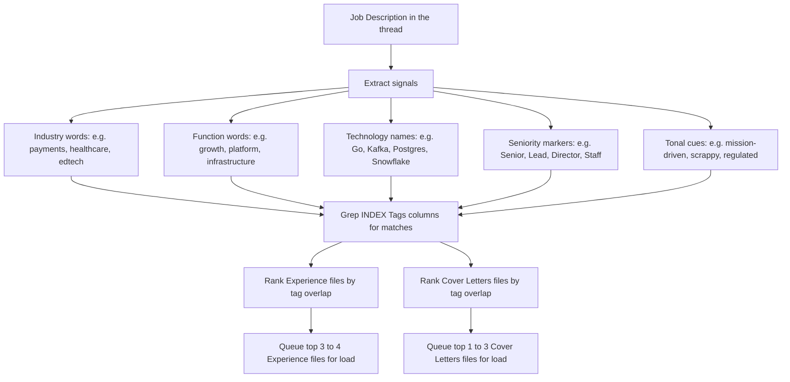

>  **License:** CC BY 4.0
>  **Reuse Policy:** You're free to share, adapt, and build upon this guide for any purpose, even commercially. Just provide proper attribution and indicate if changes were made.

---

# The Resume-Builder Skill Workflow

This deep dive walks through what actually happens inside the `resume-builder` skill when you trigger it. The main guide treated the skill as a black box that produces a first draft. Here we open the box: the eleven steps the skill walks, how Job Description (JD) tag matching works inside the load step, how the skill honors guard rules, the pitfalls that show up if you skip parts of the workflow, and how to customize the skill for your own situation.

Read Deep Dive 1 first if you have not already. The Career Brain Trust structure is what this skill loads from; the structure and the skill were designed as a pair.

---

# What the Skill Actually Does

The `resume-builder` skill is a reusable workflow. You trigger it by trigger phrase, point it at a Job Description, and it produces a combined cover letter and tailored resume as a Word document inside your project folder.

The skill is not a one-shot prompt. It is a multi-step workflow with explicit handoffs between steps. Some steps run autonomously. Other steps pause to ask you a multi-choice clarifying question and wait for your answer before proceeding. The interleaving of automated steps and clarifying questions is what makes the output good. The skill is not trying to guess your intent; it is asking the right questions at the right moments so the draft converges on something you would actually send.

A few things the skill explicitly does not do. It does not invent metrics. It does not pull bullets from its training data. It does not write content that is not anchored in your Career Brain Trust. Every line in the draft traces back to a canonical bullet, a variant framing, a positioning statement, or a reusable hook that already exists in your folder. The skill is a curation engine, not a generation engine. If the bullet did not exist in your Brain Trust before this conversation, the skill will not put it in the draft.

---

# The Eleven-Step Workflow

The skill walks the same eleven steps every time. The steps are stable; what changes between applications is which files get loaded and which clarifying questions get asked.

**Step 1: Ingest the Job Description.**
The skill reads the `Job Description.md` file in the project folder, parses the role title, company name, seniority, and the explicit requirements list. If the file is missing or empty, the skill stops and asks for the Job Description before continuing.

**Step 2: Read the INDEX and select files to load.**
The skill reads `INDEX.md` first, loads the always-load top-level files (the small Identity, Chronology, Skills, Achievements, Education, and Cover Letter Patterns and Hooks files), then greps the INDEX Tags columns for matches against the Job Description signals. Three or four Experience files and one to three Cover Letters archetype files are queued for selective load.

**Step 3: Load the selected files.**
The queued Experience and Cover Letters files load. The total payload (always-load files plus selected files) sits well under the tool truncation limit. The skill now has the relevant context for this specific application without the noise of unrelated material.

**Step 4: Clarifying questions.**
Before drafting, the skill asks you a short multi-choice block. Typical questions: which positioning angle to lead with, which archetype to use for the cover letter, whether to include a specific advisory engagement that did or did not fit the Job Description, whether the role calls for the formal or punchy register. You answer with a copy-paste sheet. The skill locks the choices and proceeds.

**Step 5: Draft the cover letter opener.**
The skill writes the first sentence of the cover letter using the chosen positioning angle and the Reusable Hooks file. The opener has to do real work: signal the match, the seniority, the specific angle the candidate brings. The skill spends a disproportionate amount of its context budget on this single sentence because it is the hardest sentence in the document.

**Step 6: Draft the cover letter body.**
Three or four bolded reasons matched to the Job Description's stated priorities, each with a short justification anchored in a real role, a real metric, or a real shipped product. The reasons are not generic ("I am a strong communicator"). They are specific to what the Job Description signaled it wanted.

**Step 7: Draft the cover letter close.**
A short, direct closing paragraph and signature. The close is short on purpose. The reader already decided whether they were interested by the time they hit the third reason.

**Step 8: Draft the resume Core Competencies block.**
One wrapped paragraph block, capped at three lines, listing only competencies the candidate can defend in an interview and that match the Job Description. No bullet-pointed list. No generic skills filler.

**Step 9: Draft the resume role bullets.**
Three to five bullets per role, ranked by relevance to the Job Description. Each bullet is anchored in a canonical bullet from the role's Experience file, lightly rephrased for this specific application. New variant framings that emerged during the conversation are captured for the update step at the end.

**Step 10: Compile the combined Word document.**
The skill uses your Application Template `.docx` file as the starting structure. Cover letter on page 1. Resume on page 2 and (sometimes) page 3. Header table at the top of each page with name, headline, contact links. Footer with page number. The output is a finished `.docx`, not a markdown file. The file lands in the project folder.

**Step 11: Post-process and quality check.**
The skill runs a final pass to catch the small mechanical issues that creep in: duplicate paragraphs in the title table, list numbering inconsistencies, stray template placeholders, line breaks in awkward places. This is the boring step that catches the unglamorous bugs.

After Step 11, the skill returns control to you. You open the document, polish in Google Docs or Microsoft Word, export to PDF (Portable Document Format), and send. The `update-brain-trust` skill takes over at the end of the thread to close the loop.

---

# How Job Description Tag Matching Works in Step 2

Step 2 is the routing step that makes the whole workflow scale. It is worth a closer look.

The Tags columns in the INDEX are the routing table. Each Experience and Cover Letter row has a Tags column with short hash-prefixed labels describing what is in the file. The Job Description has natural-language signals (industry words, function words, technology names, seniority markers, tonal cues). The skill's job in Step 2 is to bridge the two.

The matching is fuzzy. The model is doing the matching, not strict regular expressions. "Payments orchestration" in the JD matches `#Payments`, `#Orchestration`, and `#FinTech` if those tags appear anywhere in the file rows. "Distributed systems at scale" matches `#Distributed`, `#Scale`, and `#Infrastructure`. "We use Kubernetes" matches `#K8s`, `#Kubernetes`, and `#Cloud` if any of those tags are present.

A few things that make this work in practice. First, tags should be canonical. Pick one spelling per concept and stick to it (`#FinTech`, not also `#Fintech` and `#fintech`). The Tag glossary in `0 How To Use.md` is where you keep the canonical list. Second, the always-load files cover the case where the Job Description is so unusual that no Experience tag overlaps strongly. The skill will still have your Identity, Chronology, and Achievements available, so it can draft a credible application even if the role is a stretch. Third, you can manually override the selection. If you tell the skill "include the advisory engagement at Acme Health even though it does not match the tag overlap," it will load that file and include it. The skill is meant to be steerable, not stubborn.

---

# How the Skill Handles Guard Rules

Guard rules are the hard, non-negotiable constraints the skill must honor on every run. They live in the `_session rules/` folder of the Career Brain Trust and are loaded as always-load files. The skill reads them before it drafts and treats them as inviolable.

Guard rules exist because some lessons are too important to relearn. The first time you ship a draft that violates a personal principle (you mentioned a credential that lapsed, you included a role that contradicts your current positioning, you let a generic skills list bloat back into the resume), you write the rule, save it as a guard, and the skill never makes that mistake again.

There are four kinds of guard rules. Most readers will end up with two or three of each kind. Here are persona-agnostic examples of each kind, so you can see the shape.

**Content exclusion rules.** These tell the skill what never to include in any draft. Examples:

- "Never include any role that predates your career pivot date. The tailored resume should reflect the career arc you are pitching, not your full work history."
- "Never include the Acme Advisory engagement on applications to clients of Acme Advisory. Conflict of interest signal."
- "Never include a Summary section on the resume. The cover letter does that job. Two summaries on one document waste a recruiter's first ten seconds."

**Phrasing rules.** These tell the skill how to write specific kinds of content. Examples:

- "Treat any lapsed certification as past tense. Write 'formerly Certification-X-certified 2022 to 2023,' never 'I am Certification-X-certified.'"
- "Use the spelled-out company name on every first mention. Use the acronym only after the spelled-out version has appeared once in the same document."
- "Replace any em dash with a colon, comma, period, or restructured sentence. Em dashes are a personal style rule."

**Format rules.** These tell the skill what specific elements must look like. Examples:

- "Core Competencies on the resume is one wrapped paragraph block, capped at three lines. No bullet-pointed list. No second column. No second block of competencies anywhere on the resume."
- "Header table at the top of every page contains exactly: name (large), headline (medium), three contact links (small). No photograph. No tagline. No mission statement."
- "Footer contains page number and nothing else. No company name. No date. No copyright."

**Conditional inclusion rules.** These trigger inclusion of specific content when the Job Description signals it. Examples:

- "When the Job Description asks for code samples, link to your GitHub profile in the cover letter, not just the resume. The recruiter reads the cover letter first."
- "When the Job Description names a specific compliance framework you have shipped against, mention the framework explicitly in the relevant resume bullet."
- "When the Job Description says 'mission-driven' or 'mission-led,' open the cover letter with a mission echo, not a credential summary."

The skill loads all `_session rules/` files on every run. They are short, often a single bolded one-liner with a one-paragraph rationale. The rationale matters because it tells the skill (and future you) why the rule exists. Rules with rationales survive longer than rules without them.

A note on how to discover guard rules. You rarely think them up in advance. They emerge from failures. The skill shipped a draft that did the wrong thing, you noticed, you fixed it, and you decided you never want to fix that same problem again. The fix becomes the rule. Most strong guard libraries have between five and fifteen rules after fifty applications. More than that and you are usually encoding stylistic preferences that belong in the Cover Letter Patterns file, not in the guard set.

---

# Common Pitfalls

A handful of failure modes show up across most readers in the first five or ten applications. Knowing the pattern in advance shortens the learning curve.

**Summary section creep.** The first draft from a fresh skill install often includes a Summary section on the resume by default. Modern templates frequently lead with one. Resist. The cover letter is the summary. Two summaries means the recruiter reads the same thing twice, in slightly different words, in the first fifteen seconds. Encode "never include a Summary section" as a guard rule on day one.

**Core Competencies bloat.** Without a format guard, Core Competencies tends to spread into a two-column list of twenty competencies, half of which the candidate cannot defend. Recruiters know this. The signal of "I have a long list of skills" is much weaker than the signal of "I have exactly five competencies and the rest of the resume proves them." Cap the block at three wrapped lines, and let the bullets do the rest.

**Fake experience.** This is the failure mode that scares people most about Artificial Intelligence (AI) drafted resumes. It is real, but only if your Career Brain Trust is thin. If your Experience files have detailed bullets, real metrics, and real shipped products, the skill draws from them. If your Experience files are sparse, the model fills the gaps with plausible-sounding fiction. The fix is upstream: fill your Brain Trust well, then the skill cannot make things up because it has the actual material to choose from. The fake-experience risk is a content-completeness problem, not a skill-design problem.

**Generic bullets.** The bullet "improved customer satisfaction through cross-functional collaboration" could be from any resume on the internet. If the bullet does not include a specific product, a specific metric, or a specific decision, it is filler. The skill will sometimes produce generic bullets if the JD tag matching pulls in a role file with weak content. The fix is to push back in the conversation: "Bullet 3 is generic. Give me three alternatives that name a specific product or metric." The skill rewrites and the next pass is sharper.

**Tone mismatch with the company archetype.** A formal credentialed cover letter sent to a scrappy startup reads off. A punchy builder-voice cover letter sent to a regulated bank reads worse. The skill tries to guess the archetype from the Job Description language, but if you have not built the right cover-letter archetype file in your Brain Trust, the skill will pick the closest match and the tone will drift. The fix is to build the archetypes that match the companies you actually target. Five archetypes will cover most of your applications.

**AI throat-clearing.** Some first drafts open with throat-clearing phrases: "I am pleased to apply," "I am writing to express my interest," "Please find attached my resume." These sentences add nothing. The opener has to do real work. Reject any opener that starts with throat-clearing and ask for three direct alternatives.

---

# Default Settings

The skill ships with default settings that work for most cases. You can override any of them at trigger time or in the clarifying-question step.

**Default output format:** combined cover letter plus resume as a single `.docx` file in the project folder. Cover letter on page 1, resume on page 2 onward. Total two pages when possible, three pages only if the resume genuinely needs the room.

**Default resume length:** one page for under five years of experience, two pages for five to twenty years, three pages only for very senior roles where a third page is necessary. Most readers will land on a two-page resume.

**Default cover letter length:** one page, four to six paragraphs. Opener, three bolded reasons with justification, optional fourth reason, close.

**Default bullet count per role:** four to five bullets for the most recent role, three to four for the next, two to three for older roles. The recency curve is intentional. Recruiters spend most of their time on the most recent role.

**Default tone register:** matched to the Job Description's tonal cues. Formal for regulated industries, punchy for startups, crisp and metrics-heavy for big-tech, mission-echoing for mission-driven roles. Override at clarifying-question time if the skill misreads the cue.

**Default Core Competencies:** five competencies, all defensible, all matched to the Job Description.

**Default file naming:** the `.docx` and the eventual PDF both follow the pattern `[Your Name] - [Role Title].pdf`. Override if the company specifies a different filename convention in the application form.

---

# Customizing the Skill for Your Own Guards

The skill is designed to be customized. The customization happens in three places.

**In `_session rules/` files.** Add a new short Markdown file in the rules folder for any new guard rule. Title it the same way the existing ones are titled (short, descriptive, lowercase with spaces). Include the rule as a single bolded one-liner, followed by a one-paragraph rationale. The skill loads it on the next run.

**In the `SKILL.md` file itself.** The skill's default settings (the bullet count per role, the resume length curve, the file naming pattern) are configured in the skill's own definition file. If you want to permanently change a default, edit `SKILL.md`. If you only want to change a default for one application, override at clarifying-question time.

**In your Career Brain Trust files.** Most "customization" is actually adding richer content to the Brain Trust. A new Cover Letter archetype, a new variant framing in an Experience file, a new positioning angle in Identity. The skill gets sharper as the Brain Trust gets richer. You are not customizing the skill; you are giving it better material to work with.

A rule of thumb. If you find yourself thinking "the skill should know X," ask whether X belongs in the Brain Trust (content), in a guard rule (constraint), or in `SKILL.md` (default behavior). Most of the time, the answer is "in the Brain Trust." The skill is generic on purpose. Your Brain Trust is what makes it yours.

---

# License and Attribution

## License

This work is licensed under [Creative Commons Attribution 4.0 International (CC BY 4.0)](https://creativecommons.org/licenses/by/4.0/).

**You are free to:**
- **Share:** copy and redistribute the material in any medium or format
- **Adapt:** remix, transform, and build upon the material for any purpose, even commercially

**Under the following terms:**
- **Attribution:** you must give appropriate credit, provide a link to the license, and indicate if changes were made. You may do so in any reasonable manner, but not in any way that suggests the licensor endorses you or your use.

## How to Attribute

If you use or adapt this deep dive, please include:

Based on "The Resume-Builder Skill Workflow," part of "Tailored, Not Templated: An AI Workflow for Resumes That Actually Land in a Brutal Job Market" by VeritasPlaybook
Original: https://github.com/VeritasPlaybook/playbook
License: CC BY 4.0
