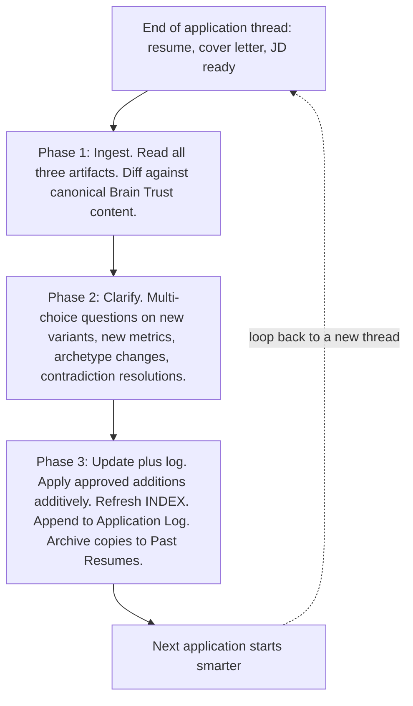

>  **License:** CC BY 4.0
>  **Reuse Policy:** You're free to share, adapt, and build upon this guide for any purpose, even commercially. Just provide proper attribution and indicate if changes were made.

---

# The Update Brain Trust Loop: Why the Loop Matters

This deep dive is about the step most people skip: closing the loop at the end of every application. The main guide called it Step 10. This is the longer version: what the loop actually does, the three-phase workflow inside the `update-brain-trust` skill, how contradictions between new and existing content get resolved, the compounding effect over fifty applications, and the weekly review pattern that catches drift before it becomes damage.

If you have not read Deep Dive 1 (the Career Brain Trust structure) and Deep Dive 2 (the resume-builder skill workflow), read those first. The Update Brain Trust loop only makes sense once you understand the source of truth it is updating and the workflow it is closing.

---

# Why Closing the Loop Matters

Every application teaches the system something. Not every application teaches the system something big, but every application teaches the system something.

A new metric you used because the Job Description (JD) signaled they cared about it. A sharper framing of a canonical bullet that you wrote in the back-and-forth with Claude on a specific role. A cover letter hook for a company archetype you had not encountered before. A constraint you noticed mid-draft ("I should never include that earlier role on applications to companies in this space") that you want to encode as a permanent guard rule. A new positioning angle that landed when you tried it for the first time.

None of that material is useful to you if it stays in last week's thread. Threads close. Context evaporates. Without an explicit step to fold the new material back into the source of truth, every application starts from the same place yesterday's application started. The system stops compounding.

The Update Brain Trust loop is the mechanism that fixes this. After every application, before you close the thread, you trigger the `update-brain-trust` skill. The skill walks a three-phase workflow that ingests the tailored resume, cover letter, and Job Description from the thread, asks you which new material to fold back in, and applies the changes additively to your Brain Trust. The INDEX timestamp refreshes. The application gets logged. Copies of the tailored files get archived to a Past Resumes folder. The next time you trigger the resume-builder skill, it has more material to draw from.

The skill is the reason the system gets sharper over time instead of starting from scratch every week. Without it, you have a fancy way to draft one resume. With it, you have a system that compounds.

---

# The Three-Phase Workflow

The skill walks three phases every time. Each phase has a specific job, and each phase ends with a pause for your confirmation before the next phase begins.

## Phase 1: Ingest with Confirmation

The skill reads three artifacts: the tailored resume `.docx`, the cover letter (if separate, or the combined file if you use the one-document format), and the `Job Description.md` file in the project folder. The skill then reads the relevant Career Brain Trust files (the same files the resume-builder skill loaded in the original application thread) and diffs the tailored content against the canonical content.

The diff is the important part. The skill is looking for:

- Bullets in the tailored resume that do not exactly match any canonical bullet or known variant in the relevant Experience file.
- Metrics in the tailored resume that do not appear in `6 Achievements.md`.
- Phrasings in the cover letter that do not match any reusable hook in `4.20 Reusable Hooks.md`.
- Cover letter structure that does not match any existing archetype in the `4.X` files.
- Positioning statements in the opener that do not exist in the Identity file's positioning library.

The skill compiles this into a short summary and shows it to you. "Here are the seven things in this application that are not currently in your Brain Trust. Do you want me to ingest them?" You confirm before the skill moves to Phase 2.

This confirmation step matters. Sometimes the new material is genuinely worth keeping. Sometimes it is one-off framing that was right for this specific company and would weaken your canonical content if you absorbed it. The skill cannot make that call. You can.

## Phase 2: Ask Clarifying Questions

The skill asks you a structured block of multi-choice questions, one for each candidate addition flagged in Phase 1. The format matches the rest of the workflow: questions numbered, answers as single letters, copy-paste sheet at the bottom.

Typical question shapes:

- "Bullet 3 in the resume is a new variant framing of the canonical bullet 'Built a real-time fraud detection platform.' Save the new variant alongside the canonical, replace the canonical with the new variant, or skip the change entirely. A, B, or C."
- "The cover letter opener uses a positioning angle that does not appear in your Identity file's positioning library. Add it as a new positioning statement tagged for this archetype, add it without a tag, or skip. A, B, or C."
- "The cover letter uses the Banking archetype structure with one new bolded reason that does not appear in any existing 4.X file. Save the new reason as a variant inside the Banking archetype file, save it as a new entry in the Reusable Hooks file, or skip. A, B, or C."
- "The tailored resume includes a new metric (an N percent reduction in some outcome) that does not appear in your Achievements file. Add the metric under the relevant employer header with this application as the source, or skip. A or B."

You answer with a copy-paste sheet. The skill confirms the answers, summarizes the planned changes, and waits for your final go-ahead before applying them.

## Phase 3: Update Plus Log

Phase 3 is the mechanical part. The skill applies the approved changes additively across the relevant files:

- New variant framings get appended to the "Variant Framings" block inside the relevant Experience file, with a date tag and a note about which application surfaced them.
- New metrics get appended to `6 Achievements.md` under the matching employer header, with the source attribution.
- New cover letter content gets appended either to the existing archetype file (as a variant) or as a new `4.NN` archetype file if the structure was genuinely new.
- New positioning statements get appended to the positioning library in `1 Identity.md`.
- The `INDEX.md` "Last updated" timestamp refreshes.

The skill then logs the application to an `Application Log.md` file (kept outside the Brain Trust folder, in your job-search root). The log entry includes the company name, the role title, the date, the file paths of the tailored resume and cover letter, and a short summary of the changes that got ingested.

Finally, the skill saves copies of the tailored resume and cover letter to a `Past Resumes/` folder (also outside the Brain Trust folder). The copies are read-only references for future you: when you find yourself drafting a similar application three months later, you can search Past Resumes by role title and find a starting point.

After Phase 3, the skill returns control to you. You close the thread. The next application starts with a richer Brain Trust than this one did.

---

# How Contradictions Get Resolved

The most interesting cases the loop has to handle are contradictions. Sometimes a new framing or metric conflicts with the existing canonical content. The skill cannot silently overwrite the canonical bullet, but it also cannot drop the new framing if it is genuinely stronger. The resolution lives in the Phase 2 clarifying questions.

There are four kinds of contradictions and four shapes of resolution.

**Contradiction Type 1: New metric, different number for the same outcome.**
The Brain Trust says you reduced fraud by 30 percent. The tailored resume said 35 percent. Either the canonical number is stale, or this application used a different time window, scope, or measurement. The skill flags the contradiction and asks: A) replace the canonical with the new number, B) keep the canonical and discard the new number, C) save both with their source attributions and let the next application decide based on context, or D) flag for manual review and do not auto-resolve.

The right answer is almost always C. Different applications use different time windows for the same wins. Both numbers are true; they are true at different scopes. Keep them both with source attribution, and let the next application's resume-builder pick the one that fits the Job Description.

**Contradiction Type 2: New framing, sharper than the canonical.**
The canonical bullet reads competent but flat. The variant you wrote in the application thread reads punchier and more specific. The skill flags the contradiction and asks whether to promote the variant to canonical, keep the canonical and save the variant alongside, or skip.

The right answer is almost always B (keep the canonical, save the variant alongside). Promoting a variant to canonical is a heavier decision than it looks. The canonical bullet has been tested against many Job Descriptions. The variant has been tested against one. Save the variant. Let it accumulate use. After three or four applications where the variant outperformed the canonical, you can promote it manually in a weekly review.

**Contradiction Type 3: New positioning angle, contradicts the Identity file.**
The Identity file says you target Director-level Product Manager roles in Payments and Fraud. The cover letter for this application positioned you for a Head of Platform role. The skill flags the contradiction and asks whether the Identity file needs updating, the positioning angle was a one-off for this specific application, or you are deliberately broadening the target.

The right answer depends on whether the broadening is intentional. If yes, update the Identity file. If no, save the positioning angle as a tagged variant in the positioning library but do not change the headline. Be conservative with Identity-file changes. The Identity file is the source of truth for who you are pitching yourself as. Changing it casually causes drift.

**Contradiction Type 4: Guard rule violation in the draft.**
The tailored resume included a role that an existing guard rule says to exclude. Either the guard rule is wrong (the rule needs updating), or the draft was wrong (the rule was bypassed in the conversation). The skill flags the contradiction and asks which it was.

The right answer is almost always to leave the guard rule alone and remove the offending content from the tailored draft before sending. If you decide the guard rule itself needs updating, do that in a weekly review, not in the heat of an application thread.

The pattern across all four types is the same. The skill flags the contradiction. You make the call. The skill applies the resolution. Contradictions never get silently resolved by the skill.

---

# The Compound Effect Over Fifty Applications

The compounding is the point. Single application, the loop adds a few framings and a couple of metrics. Trivial. Over fifty applications, the picture changes.

At application five, the Brain Trust looks roughly the same as it did at application one. Most of the new content is one-off variants that are not yet established as patterns.

At application fifteen, you have three or four cover letter archetypes that emerged from real applications, each with two or three documented variants. The Achievements file has roughly a dozen new metrics that the resume-builder skill can now pull from. The positioning library has six or seven new angles. The next application starts with materially more material to choose from than application one did.

At application thirty, the Brain Trust has the shape of a real source-of-truth. Five to seven cover letter archetypes, each with multiple variants. Twenty-plus new metrics, organized by employer. Ten or more new positioning angles, tagged by archetype. The resume-builder skill is now routing tag matches against a much denser set of options, so the drafts converge faster on the right framing.

At application fifty, the compounding is undeniable. Time per application drops from roughly twenty minutes to about twelve, because the skill's first draft is so close to the final version that fewer revisions are required. Quality also goes up, because the skill is no longer drafting from a thin set of canonical bullets; it is selecting from a rich library of pre-tested variants. The same person sending application fifty produces a meaningfully better application than they did sending application one, with less time invested.

The compounding only works if the loop closes after every single application. Skip even ten percent of the loops and the curve flattens. The Brain Trust still grows, but it grows in fits and starts, with gaps where the new material from un-ingested applications never made it home.

A small but important note: the loop is also the mechanism that catches what worked. If application twenty-three landed a phone screen and application twenty-four did not, the diff between what was different is in the loop's records. The Application Log keeps the metadata. The Past Resumes folder keeps the files. Weekly reviews (the next section) are where you actually look at the patterns and decide what to do with them.

---

# Common Drift Patterns and the Weekly Review

Drift is what happens when individual application choices accumulate into something the original system did not intend. Drift is not the skill's fault; drift is the cost of any system that compounds. The weekly review is the mechanism that catches drift before it becomes damage.

The review takes roughly twenty minutes once a week. You open the Brain Trust, scan the recent changes, and look for the drift patterns below.

**Variant bloat.** The Variant Framings block inside an Experience file has accumulated forty variants of the same bullet. The skill is starting to pick variants that are barely distinguishable from each other. The fix is to dedupe: keep the three or four genuinely different variants and archive the rest.

**Achievement duplication.** The same metric appears in `6 Achievements.md` under multiple employer headers because two different applications cited it with slightly different framings. The fix is to consolidate: pick one canonical entry, link the application sources, and remove the duplicates.

**Archetype creep.** You have eleven cover letter archetypes when six would cover your actual targeting. The eleven came from edge-case applications that did not need their own archetype. The fix is to merge: collapse the edge-case archetypes back into the five or six core archetypes they were variants of, with a "use this for X-shaped roles" note.

**Positioning library spread.** The positioning library in the Identity file has twenty angles, half of which contradict each other. The fix is to retire: keep the eight or nine you actually use, tag them by archetype, and remove the rest from the active list.

**Stale guard rules.** A guard rule from six months ago is no longer relevant because your career situation changed. The rule keeps firing on every application and producing slightly worse drafts. The fix is to retire the rule. Move it to an `_archived rules/` subfolder for historical record, but stop loading it on every run.

**Tag glossary drift.** Tags that used to mean one thing now mean another, or two spellings of the same tag are competing. The fix is to canonicalize: pick one spelling per concept, update every row in the INDEX that uses the wrong spelling, and document the canonical tag in `0 How To Use.md`.

The weekly review is the only place these drift fixes happen. The `update-brain-trust` skill is deliberately additive. It will not delete content or rename tags during a normal application loop. Cleanup is your job, on your schedule, with the full picture in front of you.

Set a recurring twenty-minute slot on your calendar for this. Sunday evening or Monday morning works for most people. The review is short, but skipping it for two months means an hour of cleanup when you finally do it.

---

# When to Skip the Loop Step

There is one legitimate case for skipping the loop on a specific application. The application produced nothing new. The skill ran. The first draft was already a strong version of canonical material. You polished and shipped without inventing any new framings, surfacing any new metrics, or writing for any new archetype.

In that case, the skill's Phase 1 diff will come back empty or nearly empty. There is no new material to ingest. You can still log the application to `Application Log.md` and archive the files to `Past Resumes/`, but the Brain Trust itself does not need an update.

The skill handles this case automatically. Phase 1 shows you "no new material flagged for ingestion." Phase 2 has no questions to ask. Phase 3 logs and archives, then exits.

The case where you should not skip the loop is "I am tired and want to close the thread." Tired-you is the person most likely to lose the new framing that took an hour of back-and-forth to land. The loop step is short. Run it.

---

# License and Attribution

## License

This work is licensed under [Creative Commons Attribution 4.0 International (CC BY 4.0)](https://creativecommons.org/licenses/by/4.0/).

**You are free to:**
- **Share:** copy and redistribute the material in any medium or format
- **Adapt:** remix, transform, and build upon the material for any purpose, even commercially

**Under the following terms:**
- **Attribution:** you must give appropriate credit, provide a link to the license, and indicate if changes were made. You may do so in any reasonable manner, but not in any way that suggests the licensor endorses you or your use.

## How to Attribute

If you use or adapt this deep dive, please include:

Based on "The Update Brain Trust Loop: Why the Loop Matters," part of "Tailored, Not Templated: An AI Workflow for Resumes That Actually Land in a Brutal Job Market" by VeritasPlaybook
Original: https://github.com/VeritasPlaybook/playbook
License: CC BY 4.0
